# Temi-Tell-Me (테미텔미)

Temi 로봇 화면 위에서 전시장을 **탐색 → 이동 → 참여 → 기록**까지 한 흐름으로 이어 주는 도슨트 안내 시스템입니다. 웹 UI가 로봇을 부르고, 로봇이 사람을 목적지로 데려갑니다.

HCI/UX 2025 최종보고서 · 팀 Temi-Tell-Me · 2025 CO-SHOW 현장 시연

본 저장소는 광운대학교 HCI/UX 수업 출품·아카이브용 프로토타입입니다. 실제 전시 환경(CO-SHOW)에서 불특정 관람객을 대상으로 사용성 평가를 수행했으며, 화면·수치는 최종보고서 및 발표 자료에서 발췌했습니다. Temi·COSS 등 표기는 시연·교육 목적의 표현입니다.

---

## 먼저 보실 것

설계 원칙은 하나입니다. **사람이 고르는 곳(탐색·추천·촬영)엔 인터랙션을, 로봇이 움직이는 곳(이동·음성)엔 SDK 결정론을.**

```bash
cd co-show
npm install          # 또는 pnpm install
npm run dev          # http://localhost:5173

# 백엔드(사진 업로드·문의)
cd backend && npm install && npm run dev
```

프로덕션 시연 URL: `https://tellme.kwidea.com/` · API: `https://tellme-api.kwidea.com/`  
Temi 실기 연동은 Android WebView APK(`co-show/android/`)에 올라간 React 앱 + `TemiInterface` 브리지로 동작합니다.

---

## 해결하려는 문제

팸플릿·고정 키오스크 중심의 정적 안내는 복잡한 전시장에서 **동선 파악·능동 탐색·개인화**를 동시에 못 합니다.

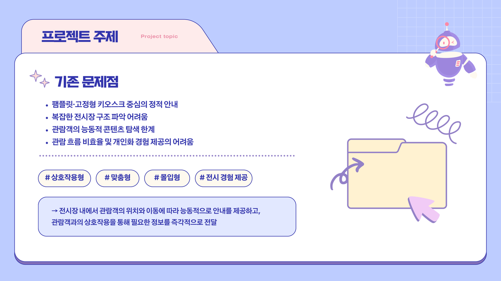

그래서 Temi-Tell-Me는 관람객 위치·이동에 맞춰 **능동 안내**하고, 화면 상호작용으로 필요한 정보를 바로 넘기는 것을 목표로 잡았습니다. 키워드는 `#상호작용형` `#맞춤형` `#몰입형` `#전시경험` 입니다.

---

## 세 개의 숫자

| 숫자 | 뜻 |
|------|-----|
| **현장 설문 24명** | Main Study 사후 설문. 자유 사용 후 Google Form으로 기능 사용·만족·오류를 수집했습니다. |
| **전시 안내 ≥22명** | 가장 많이 쓴 기능. 일정·추천·퀴즈도 약 18명 내외로 따라왔습니다. |
| **Pilot 10 · Post 10** | 웹만으로 먼저 고치고(Pilot), 현장 네트워크 이슈를 걷어낸 뒤 Task로 다시 봤습니다(Post). |

현장 Top 사용 기능은 **전시 안내 / 일정 확인 / 사진·QR 저장**이었습니다. 이탈·지연은 대부분 로딩·업로드·QR 생성 등 **네트워크 의존 구간**에서 났습니다.

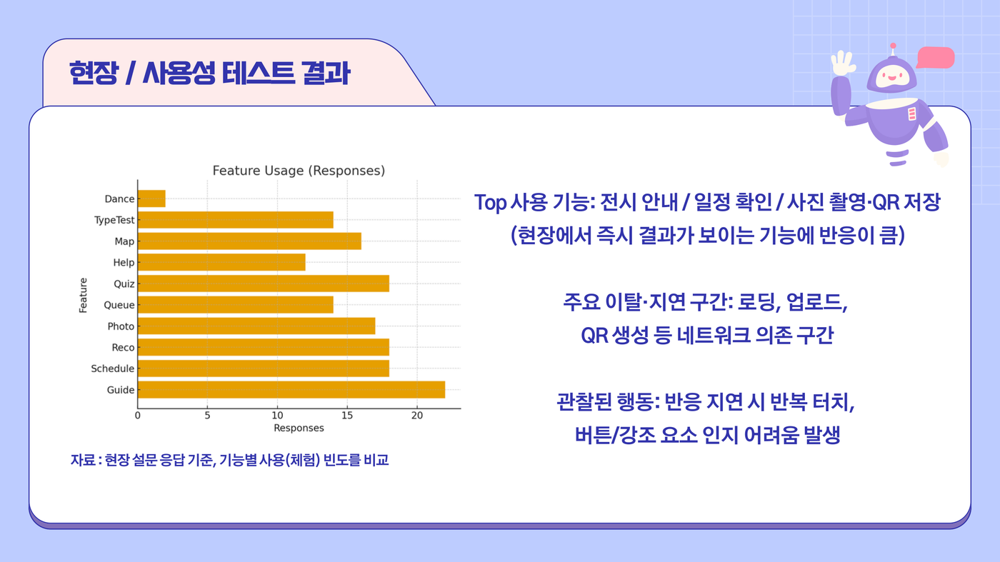

---

## 화면 흐름 — 데모 6막

`npm run dev` 후 브라우저로 열거나, Temi 화면(1920×1200)에서 같은 라우트를 탑니다.

### 1막 — 홈이 여섯 갈래를 연다

카드 네비게이션으로 전시장 안내·일정·이벤트·줄서기·포토존·문의에 바로 들어갑니다.

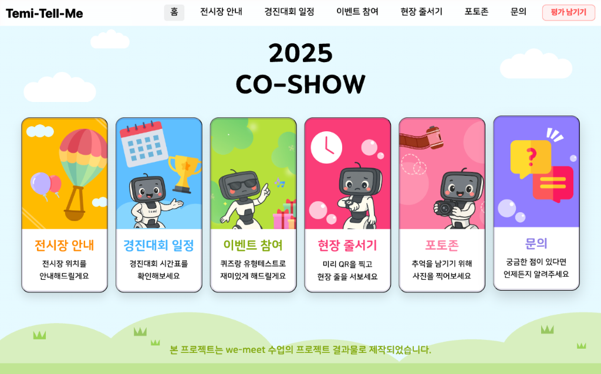

### 2막 — 안내 허브에서 지도·존·추천으로 분기한다

“어디로 데려다줄까?” — 전체 지도, 지능형로봇 존, 추천 장소로 갈라집니다.

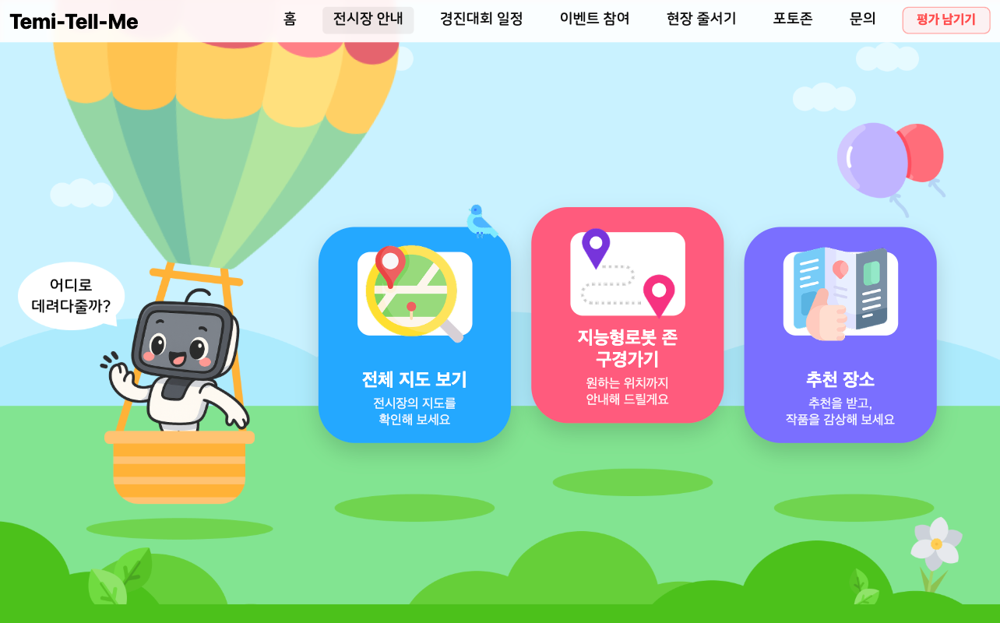

### 3막 — 지도·기차 UI로 18개 존을 고르고 Temi를 부른다

그리드·검색·하단 기차 레인으로 존을 고르면 우측 패널에 소개와 **테미의 길 안내 받기**가 뜹니다. `window.temi.goTo(location)`이 Android 브리지를 통해 SDK `robot.goTo`로 넘어갑니다.

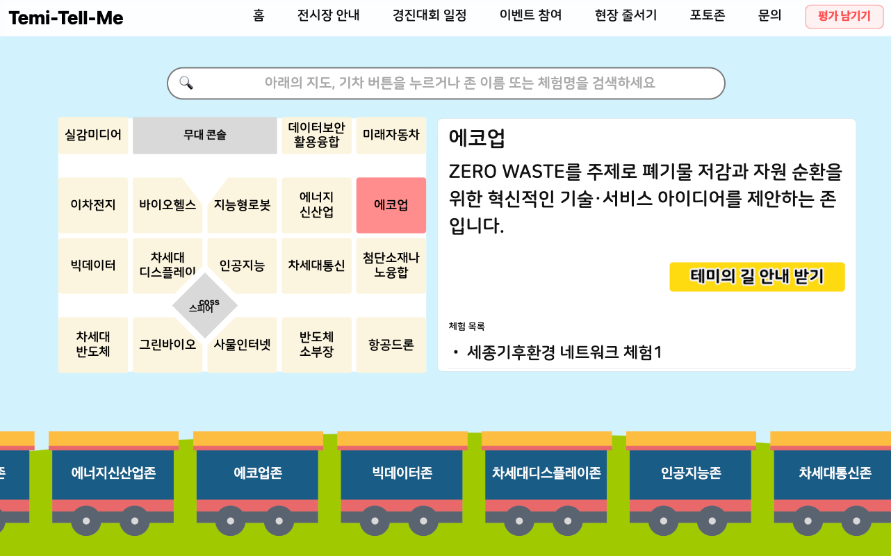

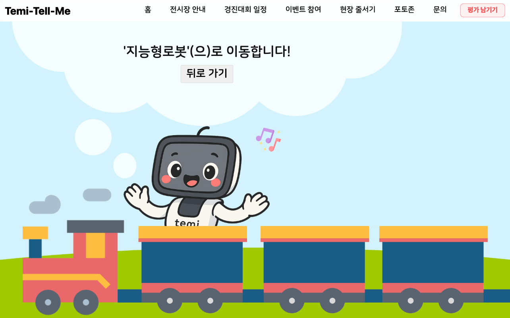

### 4막 — 조건으로 추천하고, 결과에서 다시 이동한다

연령·체류 시간·신청 방식으로 걸러 추천한 뒤, 존 상세에서 곧바로 길 안내로 이어집니다.

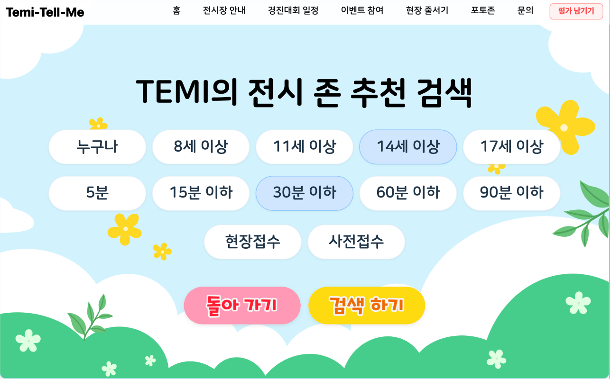

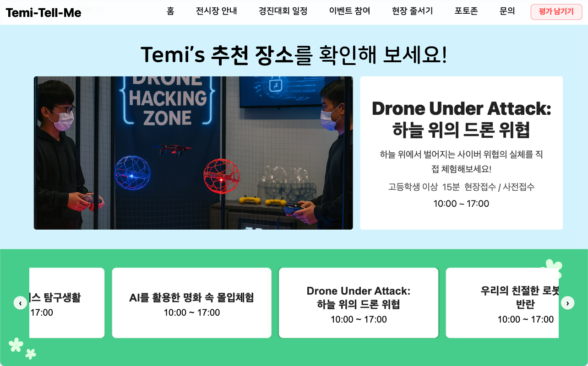

### 5막 — QR로 줄 서고, 같은 화면에서 길 안내를 받는다

지능형로봇 존 8개 체험 프로그램별 QR. 스캔 후 **길 안내 받기**로 동선이 끊기지 않게 했습니다.

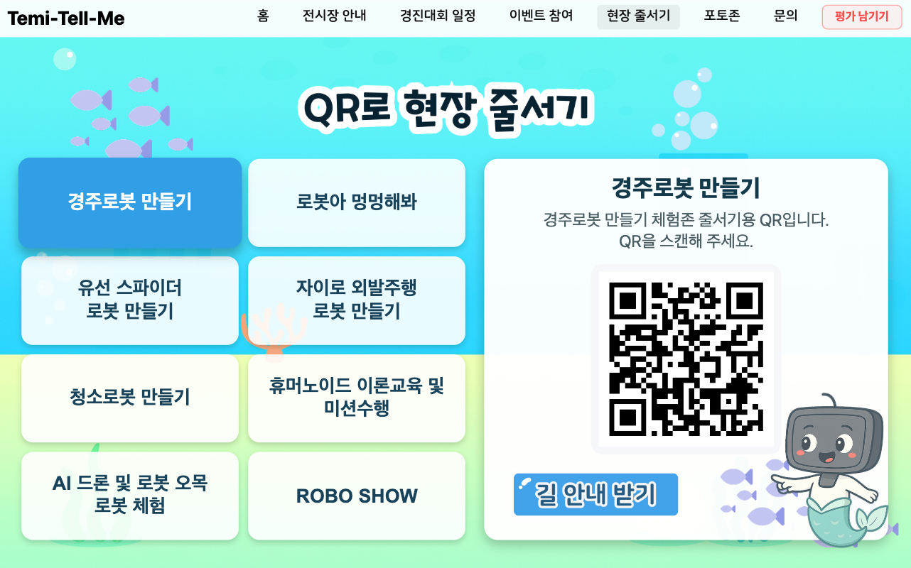

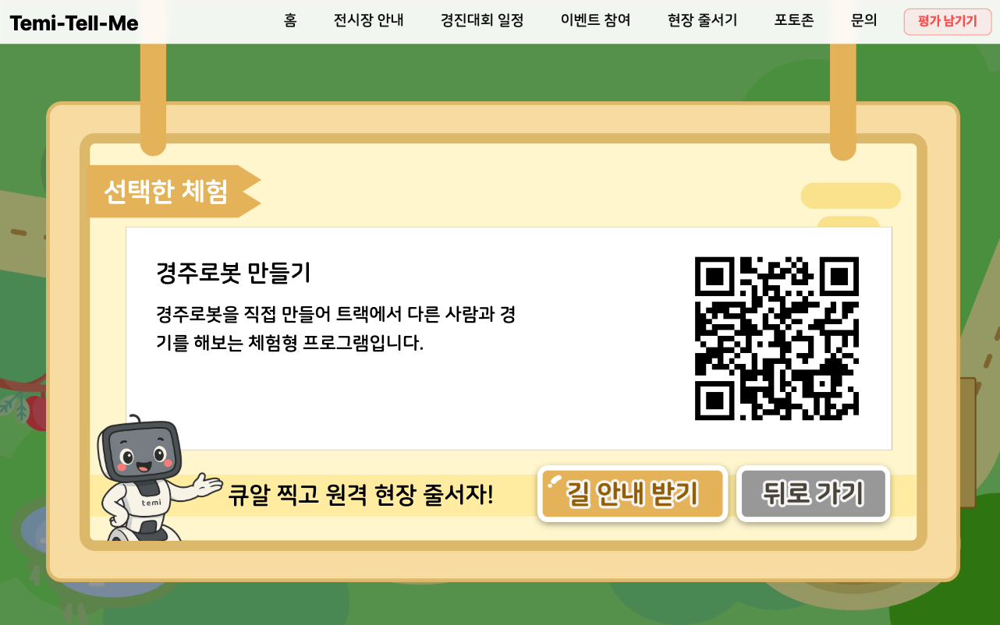

### 6막 — 일정·이벤트로 참여를 닫는다

경진대회 목록·상세, 추첨용 전화 입력까지 한 앱 안에서 이어집니다. (전화번호는 추첨용·사용 후 폐기 안내)

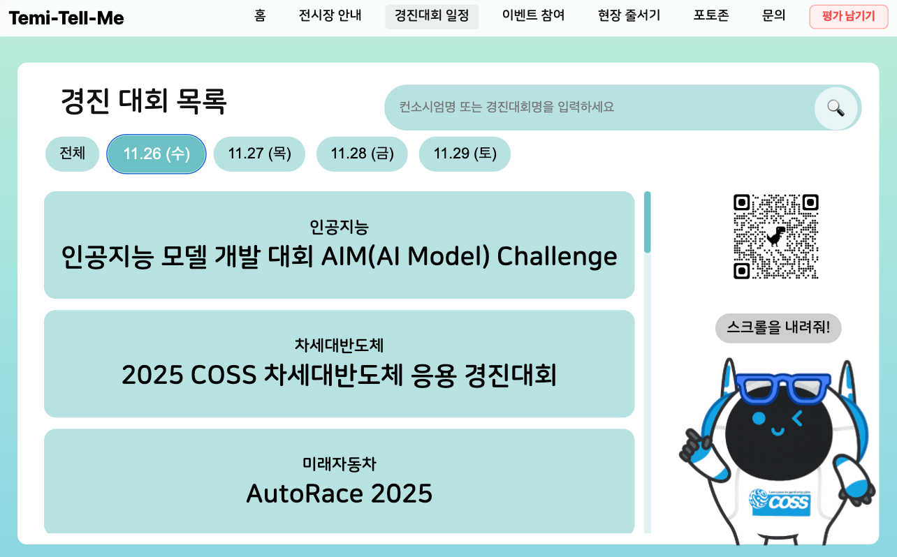

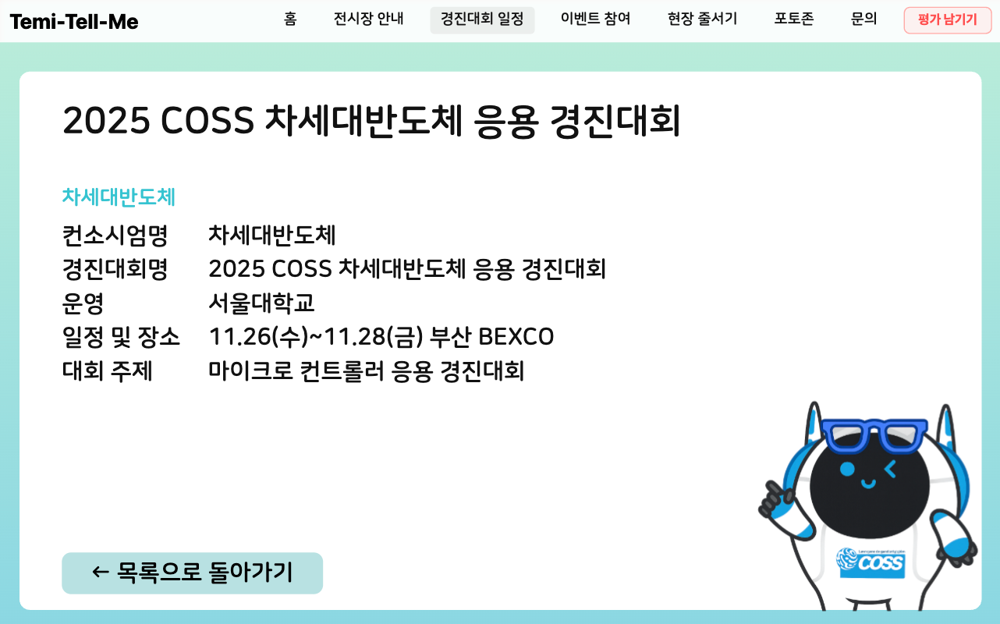

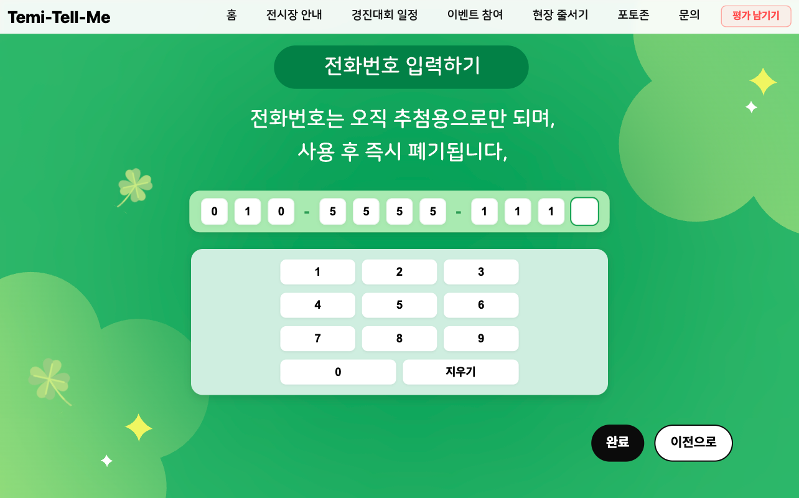

---

## 구현 정도

| 영역 | 상태 | 비고 |
|------|------|------|
| React 웹 UI (Hash Router) | 구현 | Temi 해상도 고정 레이아웃, 40+ 라우트 |
| 전시장 지도·기차 탐색·검색 | 구현 | 18개 존 정적 데이터 (`zoneIntro.js`) |
| Temi 길 안내 · TTS · 댄스 | 구현 | `TemiInterface.java` ↔ `window.temi` |
| 현장 줄서기 QR | 구현 | 프로그램별 QR + 길 안내 연계 |
| 포토존 필터·업로드·QR | 구현 | Canvas 합성 → `POST /upload-photo` |
| 퀴즈·유형 테스트·추천 | 구현 | 결과 → 길 안내 연결 |
| 문의 · Telepresence 호출 | 구현 | Prisma/SQLite 저장 + 직원 연결 |
| 대기 화면 인사/작별 | 구현 | 접근 장벽을 낮추는 첫인상 |
| 현장 줄서기 실시간 대기열 서버 | 제한 | 시연·고정 QR 위주 (실시간 로직은 환경에 따라 제한) |
| 로그인·권한·관리자 콘솔 | 미구현 | 프로토타입 범위 밖 |
| 외부 LLM 호출 | 없음 | 로컬·자체 서버만 |

아키텍처는 **WebView 위의 React → JS Bridge → Temi SDK**, 옆에 **Node/Express**가 사진·문의·QR URL을 받습니다.

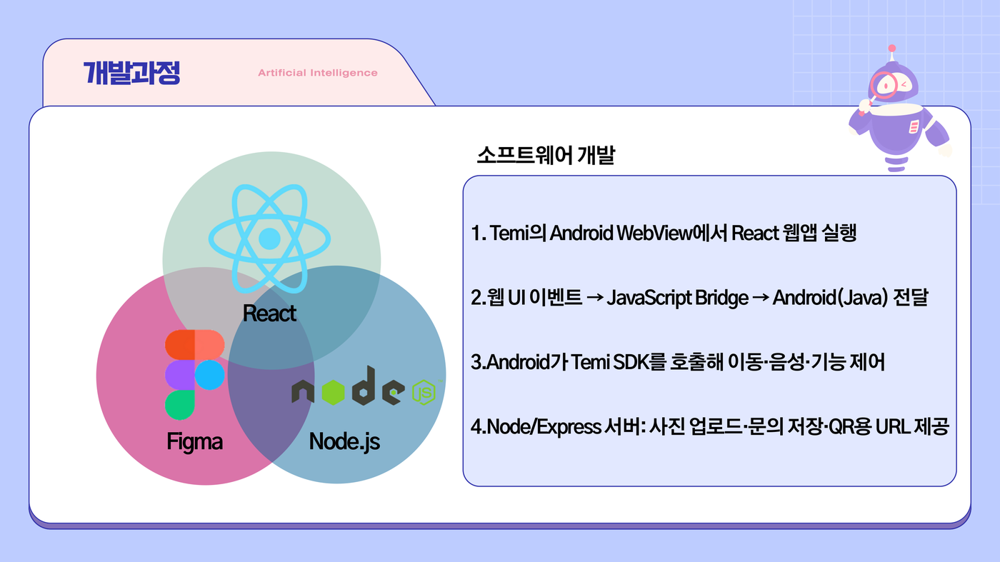

```
┌─────────────────────────────────────┐
│      Android WebView (Capacitor)    │
│  React (Vite)  ↔  TemiInterface     │
│                 (JavaScript Bridge) │
└─────────────────────────────────────┘
                ↕ HTTPS
┌─────────────────────────────────────┐
│   Node.js / Express + Prisma/SQLite │
│   업로드 · 문의 · /uploads 서빙     │
└─────────────────────────────────────┘
```

---

## 평가 — 정직하게

혼합연구: **현장 관찰 + 사후 설문(24명)** , 보조로 Pilot(웹 10명)·Post(실습실 Task 10명).

**잘 된 것**
- 전시 안내·일정·사진/QR처럼 **즉시 결과가 보이는** 기능에 반응이 컸습니다.
- “원하는 기능을 찾기 쉬웠다”, “조작이 복잡하지 않았다” 쪽에서 긍정 응답이 많았습니다.
- Post Study에서는 현장의 로딩·업로드 오류가 거의 사라져, 장애의 주원인이 **전시장 네트워크**임을 갈랐습니다.

**깨진 것**
- 오류 Top: 페이지 로딩 실패 → 화상 통화 연결 실패 → 이미지 업로드 지연 → 로봇 움직임.
- 예고 없는 회전·tilt에 뒤로 물러서는 반응, 강조색·뒤로가기 인지 실패, 반복 터치가 관찰되었습니다.
- 오류 경험 집단은 만족·재사용 의향이 낮아지는 경향이 있었습니다.

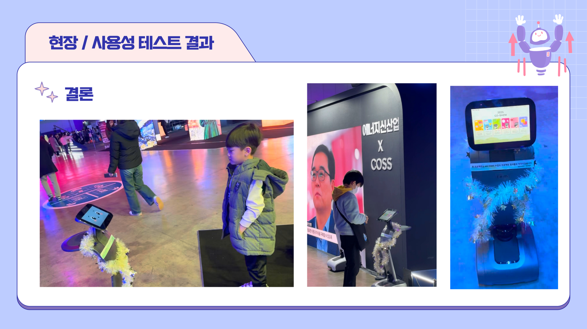

### 디자인 가이드라인 (보고서 6-3)

1. **이동 전 의도 고지** — 시각·음성으로 “지금 ○○존으로 이동합니다”.
2. **한 화면–한 행동** — 전시장은 집중이 짧다. 카드 홈, 텍스트·버튼 최소화.
3. **즉시 성취감을 핵심에** — 사진·추천 결과·안내 완료처럼 바로 손에 남는 UX.
4. **네트워크 실패를 전제** — 로딩 표시, 재시도, 오프라인 대체 문구.
5. **연령대 이중 전략** — 가독성·터치 타깃은 넓게, 피드백은 빠르게.

---

## 구조

```
co-show/
├── src/
│   ├── pages/                 # 홈 · 지도 · 길안내 · 줄서기 · 포토 · 퀴즈 …
│   ├── data/                  # zoneIntro · quiz 등 정적 데이터
│   └── main.jsx               # Hash Router
├── android/                   # WebView + TemiInterface (SDK 브리지)
├── backend/                   # Express · Prisma · 업로드/문의
└── co-show/docs/readme-assets/screens # 최종보고서·발표에서 발췌한 화면
```

| 영역 | 기술 |
|------|------|
| 프론트 | React 19, Vite, React Router (Hash), CSS |
| 로봇 | Temi SDK (Java), `@JavascriptInterface` |
| 백엔드 | Node.js, Express, Prisma, SQLite, Multer |
| 배포 | Vercel (웹), 자체 서버 (API), Gradle APK |

---

## 만들지 않은 것

프로덕션급 인증·권한, 관리자 대시보드, 실시간 대기열 스케줄러, 실채널 문자/푸시, LLM 기반 대화.  
승인과 발송이 갈리는 은행 콘솔이 아니라, **현장 관람객이 만지고 로봇이 움직이는** 쪽을 끝까지 밀었습니다.

---

## 문서·출처

- 최종보고서: *실제 전시 환경에서의 도슨트 로봇 서비스 구현 및 사용자 경험(UX) 평가* (2025.12)
- 팀: 김초련 · 이지우 · 유아름 · 신현우 · 박형섭 / 지도 박규동
- 지원: 한국연구재단 디지털 혁신공유대학사업(지능형로봇 혁신융합대학 사업단)
- 본 README 이미지는 최종보고서 BinData 및 발표 PDF에서 발췌·정리했습니다.

```bash
# Android APK
cd android && ./gradlew assembleDebug
```
